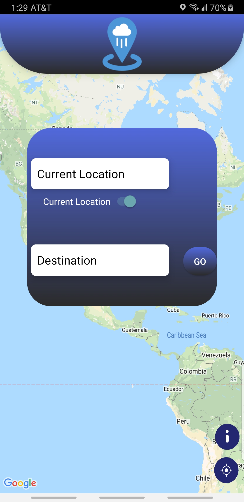
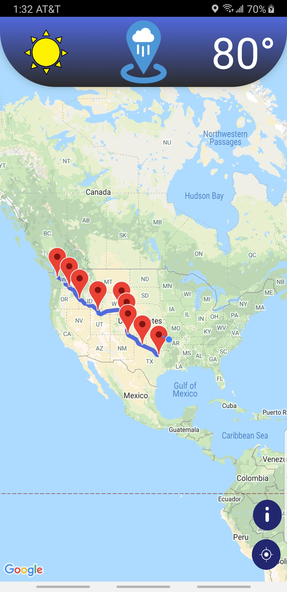
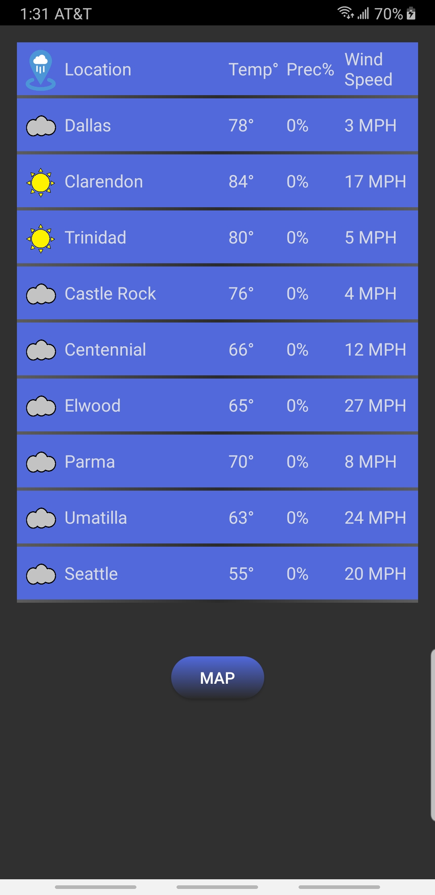
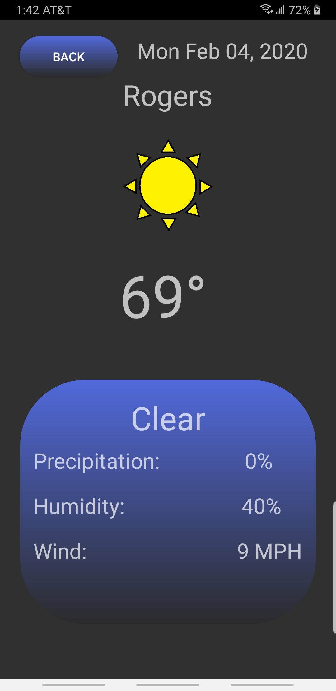

 WeatherWays is an application designed to help travelers reach their destination while avoiding dangerous weather conditions. It is designed to allow the user to create a route for their trip and be informed about the weather conditions they will encounter along their travels. The intentions of the application is to provide a safer trip for users while they are travelling.
 

 
 When the WeatherWays application initially loads, the user can click the WeatherWays icon at the top of the screen. This will provide a pop-up box to generate the desired route shown above. The user only needs to choose an initial position, or click the toggle switch for their current location, and enter a final destination. Once the user has decided on their locations, they just need to hit the “GO” button.
 

 
Once your route has been decided, WeatherWays will generate your route on the map, as shown above. Along the route, WeatherWays will add markers to locations, which will be used to gather weather information. If you decide to change your route, You can simply click the WeatherWays icon at the top again. Now that the route is displayed on the map, you can view the weather condition along your route. To do this, you can simply click the weather image in the top left corner of the map, or you can directly click on one of the location markers along your route. If you click the weather image, you will be taken to a list containing all the locations along your route, otherwise you will be taken directly to the location you clicked. 
 

 
The list view is brought up when you click on the weather icon, after creating a route. In this view you will be able to get a quick overview about some of the weather information along your route in a glance. The list contains several locations along your chosen route. Each of the locations provides information about that location for the time you will be arriving. The information provided includes an icon illustrating the weather conditions, as well as the temperature, precipitation, and wind speeds. If you're interested in a particular location along your route, you can simply click on that location and you will be taken to an in-depth view of that location. 
 

 
The in-depth view can be accessed by either clicking on a location marker in the map view, after a route has been created, or by clicking on a location from the list view. The in-depth page provides additional weather information about a location when you will arrive at that location. You can get information about the location at the time of your arrival, including an icon depicting the weather conditions, the temperature, precipitation, wind, and humidity.  When you are done viewing the information about the location, you can simply click the “BACK” button at the top to go back the list view of your route. 
